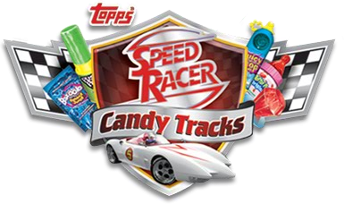
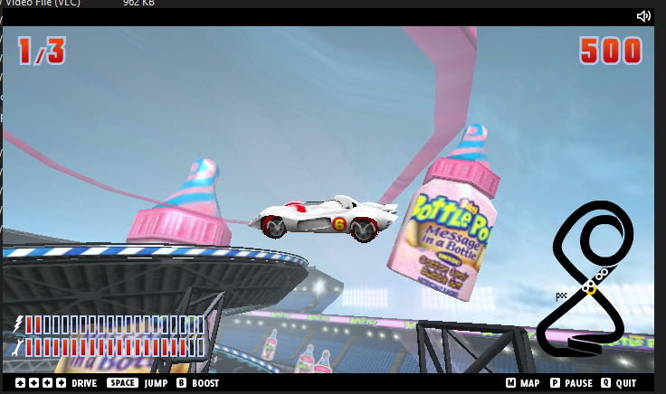

# 🏎️ Speed Racer: Candy Tracks
  
*A restoration and preservation project for the lost-media Speed Racer Shockwave game*

---

# WARNING!!
# THE LOGIN SYSTEM IS NOT FUNCTIONAL, PLAY THE GAME BY GOING IN DEMO MODE
---

## 📖 Overview
**Speed Racer: Candy Tracks** is a restoration and preservation project based on *Topps’ Candy Tracks*, an Adobe Shockwave 3D racing game developed by **Blit Interactive** in 2008.

When the *Speed Racer* movie promotion ended, the game was stripped of its original *Speed Racer* assets and branding, leaving behind only a generic “Candy Tracks” version. This project aims to **restore the missing media, assets, and functionality** to recreate the authentic *Speed Racer* experience as it existed during its original release.

---

## 🎯 Goals
- 🏁 Restore original *Speed Racer* textures, sounds, and 3D models  
- 🎨 Restore missing UI elements and branding 
- 🧩 Preserve gameplay behavior and physics accurately  
- 🕹️ Archive the project for historical and educational purposes  

---

## ⚙️ Current Progress
- ✅ Full access to the original Shockwave source files (`.dir`, `.cst`, `.dcr`)  
- ✅ Obtain the original asset files (Special thanks to Solarstance, Owner of Iron Monkey)
- ✅ Reimplementation of the original asset files.
- 🧱 Documenting and comparing original *Speed Racer* promotional builds  

---

## 🧠 About the Original Game
*Candy Tracks* was a 3D racing game that let players drive Topps' candy-themed cars through colorful tracks while collecting sweets and avoiding crashing. The original *Speed Racer* edition featured branded cars, track banners, and objects based off the 2008 film — all of which were later removed due to the 08' Promotion period ending.

---

## 🧩 Technical Notes
- Original engine: Adobe Director / Shockwave 3D  
- Language: Lingo  

---

## 📜 Legal Notice
This is a **non-commercial preservation project**.  
*Speed Racer* and related assets are the property of **Warner Bros.** and **Topps Company, Inc.**  
All rights to the original intellectual property belong to their respective owners.

---

## ⚡ Future Plans
- Host a playable demo for archival purposes
